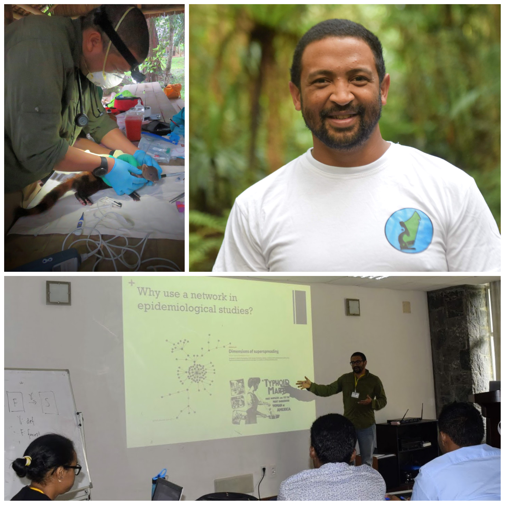
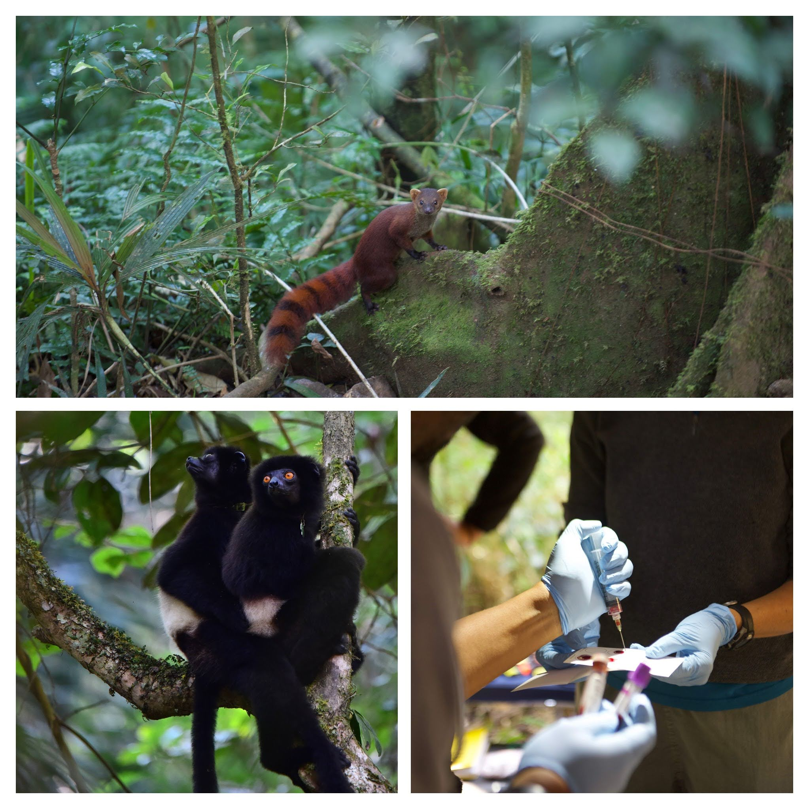
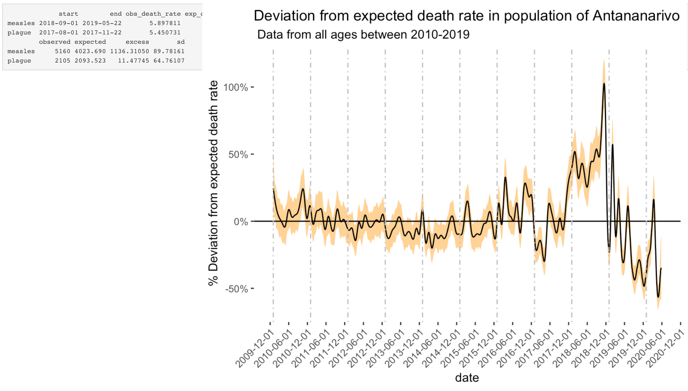
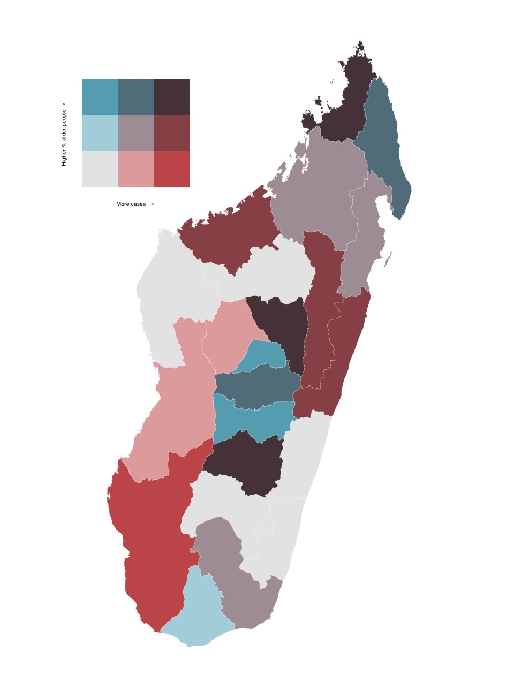

<!-- Google tag (gtag.js) -->
<script async src="https://www.googletagmanager.com/gtag/js?id=G-G5Q9PG727J"></script>
<script>
  window.dataLayer = window.dataLayer || [];
  function gtag(){dataLayer.push(arguments);}
  gtag('js', new Date());

  gtag('config', 'G-G5Q9PG727J');
</script>


```{r setup, include=FALSE}
library(flexdashboard)
library(tidyverse)
library (lubridate)
library(tidygraph)
library(igraph)
library(graphlayouts)
library(reshape2)
library(influenceR)

```

# About {data-navmenu="About"}

## Column {data-width="500"}

**About Fidisoa Rasambainarivo**

I am a wildlife veterinarian interested in the ecological approaches to health and particularly the **"One Health" concept** and the field of **"Conservation Medicine"**. I study the multiple interactions between human, domestic animal and wildlife health in Madagascar.

I obtained my veterinary degree from the Department of Veterinary Medicine and Sciences (DESMV) of the University of Antananarivo, Madagascar and a Master's degree in epidemiology from the faculté de médecine vétérinaire of the Université de Montréal, Canada and a PhD in Biology (Ecology, Evolution and Systematics) at the University of Missouri Saint Louis, USA.

Using a combination of fieldwork, laboratory and data analysis as well as computational modeling, my research interests focus on the potential impacts of humans and domestic animals on wildlife health in various ecosystems in Madagascar.

To facilitate research in Madagascar, help build local scientific capabilities of Malagasy researchers and advance conservation science, I co-founded **Mahaliana Labs** in Madagascar and act as the scientific director. At Mahaliana, I lead and manage several research projects, mainly on the health and diseases of wild animals and their interactions with humans & domestic animals.

.png){width="60%"}

## Column {data-width="600"}

### 

{width="50%"}

# CV {data-navmenu="About"}

## Column {data-width="400"}

### **Fidisoa Rasambainarivo, DVM, MSc, PhD**

***Professional experience***

2019 - Present : Postdoctoral Research Associate, Princeton University

2018 - Present : Co-founder and Scientific Director, Mahaliana Labs

2018 - Present : Lecturer (Epidemiology), Department of Veterinary Sciences and Medicine, University of Antananarivo\

2008 -- 2011 : Staff veterinarian, Madagascar Fauna and Flora Group, Ivoloina Zoological Park

***Education***

2013 -- 2018: PhD in Biology (Ecology, Evolution and Systematics) University of Missouri Saint Louis - *Wildlife and Domestic Animal Health: interactions and disease transmission in and around protected areas in Madagascar*. Advisor: Patricia Parker, PhD

2011 - 2013 : MSc in veterinary sciences (option: Epidemiology) Faculté de médecine vétérinaire- Université de Montréal, Canada - -*Prevalence of potentially zoonotic parasites at the human wildlife interface in the Ranomafana National Park ecosystem in Madagascar.* Advisors: Stéphane Lair DMV, DES, Dipl. ACZM & Julie Arsenault DMV, MSc, PhD

2007: Internship in conservation medicine Saint Louis Zoo, Duke Lemur Center, University of Missouri Columbia, USA. Advisors: Randall E Junge, DVM MS Dipl. ACZM, Cathy Williams DVM Dipl. ACAW

2002 -2008 : Doctor of veterinary medicine Department of veterinary sciences and medicine, University of Antananarivo, Madagascar

***Teaching Experience***

*Lectures and workshops*

2019 - present: Epidemiology, lecturer, 5th year veterinary students\
Department of Veterinary Sciences and Medicine, University of Antananarivo, Madagascar

2019 - present : MolEcol & R: Molecular biology and diagnosis - Instructor: Designed and delivered lectures and exercises for introductory molecular biology and diagnostics methods for Biology, Public Health and Veterinary students in Madagascar

2018 - Present : E2M2: Ecological and Epidemiological Modeling in Madagascar. Instructor: Designed and delivered lectures and exercises for introductory programming workshop for Biology, Public Health and Veterinary students in Madagascar (Network Modeling, Occupancy Modeling, Spatial Analysis)

2022 : Guest lecture in Epidemiology (GHP351) Princeton University 2021 : Guest lecture in Infectious disease dynamics (IB114) University of California-Berkeley

2021 : Guest lecture on "One Health" in Primate Conservation (ANTH203) at Yale University 2017 : Anatomy and Physiology, Teaching Assistant, Undergraduate biology major.

## Column {data-width="500"}

**Publications**

***Journal articles***

**Rasambainarivo, F.**, Ramiadantsoa, T., Raherinandrasana, A., Randrianarisoa, S., Rice, B. L., Evans, M. V., ... & Metcalf, J. C. (2022). Prioritizing COVID-19 vaccination efforts and dose allocation within Madagascar. BMC public health, 22(1), 1-9.

Wampole, E. M., Gerber, B. D., Farris, Z. J., Razafimahaimodison, J. C., Andrianarisoa, M. H., Ralazampirenena, C. J., **Rasambainarivo F**... & Larney, E. (2022). Madagascar Terrestrial Camera Survey Database 2021: A collation of protected forest camera surveys from 2007--2021.

Ramiadantsoa, T., Metcalf, C. J. E., Raherinandrasana, A. H., Randrianarisoa, S., Rice, B. L., Wesolowski, A., ... & **Rasambainarivo, F.** 2021. Existing human mobility data sources poorly predicted the spatial spread of SARS-CoV-2 in Madagascar. Epidemics, 100534.

Andriamandimby, S. F., Brook, C. E., Razanajatovo, N., Randriambolamanantsoa, T. H., Rakotondramanga, J. M., **Rasambainarivo, F.**, ... & Dussart, P. 2021. Cross-sectional cycle threshold values reflect epidemic dynamics of COVID-19 in Madagascar. Epidemics, 100533.

Baker RE, Mahmud AS, Miller IF, Rajeev M, **Rasambainarivo F**, Rice BL, Takahashi S, Tatem AJ, Wagner CE, Wang LF, Wesolowski A. Infectious disease in an era of global change. Nature Reviews Microbiology. 2021 Oct 13:1-3.

Rice, B.L., Annapragada, A., Baker, R.E., Bruijning, M., Dotse-Gborgbortsi, W., Mensah, K., Miller, I.F., Motaze, N.V., Raherinandrasana, A., Rajeev, M., Rakotonirina, J., Ramiadantsoa T., **Rasambainarivo F.** and Metcalf, C.J.E., 2021. Variation in SARS-CoV-2 outbreaks across sub-Saharan Africa. Nature Medicine, 27(3), pp.447-453.

**Rasambainarivo, F.**, Rasoanomenjanahary, A., Rabarison, J.H., Ramiadantsoa, T., Ratovoson, R., Randremanana, R., Randrianarisoa, S., Rajeev, M., Masquelier, B., Heraud, J.M. and Metcalf, C.J.E., 2020. Monitoring for outbreak associated excess mortality in an African city: Detection limits in Antananarivo, Madagascar. International Journal of Infectious Diseases.

Blanco, M.B., Greene, L.K., **Rasambainarivo, F.**, Toomey, E., Williams, R.C., Andrianandrasana, L., Larsen, P.A. and Yoder, A.D., 2020. Next-generation technologies applied to age-old challenges in Madagascar. Conservation genetics, 21(5), pp.785-793

Irwin, M.T., Samonds, K.E., Raharison, J.L., Junge, R.E., Mahefarisoa, K.L., **Rasambainarivo, F.**, Godfrey, L.R. and Glander, K.E., 2019. Morphometric signals of population decline in diademed sifakas occupying degraded rainforest habitat in Madagascar. Scientific reports, 9(1), pp.1-14.

**Rasambainarivo, F**, Andriamihajarivo MN, Dubovi E, Parker PG., 2018 Patterns of exposure of carnivores to selected pathogens in the Betampona Natural Reserve landscape, Madagascar. Journal of Wildlife Disease.

**Rasambainarivo, F.**, Farris, Z. J., Andrianalizah, H., & Parker, P. G., 2017. Interactions between carnivores in Madagascar and the risk of disease transmission. EcoHealth, 14(4), 691-703.

Brown, K. A., Farris, Z. J., Yesuf, G., Gerber, B. D., **Rasambainarivo, F.**, Karpanty, S., & Johnson, S. E., 2016. Modeling co-occurrence between toxic prey and naïve predators in an incipient invasion. Biodiversity and Conservation, 1-19

Pomerantz, J., **Rasambainarivo, F.T.**, Dollar, L., Rahajanirina, L.P., Andrianaivoarivelo, R., Parker, P., Dubovi, E., 2016. Prevalence of antibodies to selected viruses and parasites in introduced and endemic carnivores in western Madagascar. Journal of Wildlife Disease.

Alexander, A.B., Poirotte, C., Porton, I.J., Freeman, K.L., **Rasambainarivo, F.**, Olson, K.G., Iambana, B., Deem, S.L., 2016. Gastrointestinal parasites of captive and free living lemurs and domestic carnivores in Eastern Madagascar. Journal of Zoo and Wildlife Medicine 47:141-49.

Zohdy, S., Grossman, M. K., Fried, I. R., **Rasambainarivo, F. T.**, Wright, P. C., & Gillespie, T. R. (2015). Diversity and prevalence of diarrhea-associated viruses in the lemur community and associated human population of Ranomafana National Park, Madagascar. International Journal of Primatology, 36(1), 143-153.

Bodager, J. R., Parsons, M. B., Wright, P. C., **Rasambainarivo, F.**, Roellig, D., Xiao, L., & Gillespie, T. R. (2015). Complex epidemiology and zoonotic potential for Cryptosporidium suis in rural Madagascar. Veterinary parasitology, 207(1-2), 140-143.

DC Bublitz, Wright, PC., Bodager, JR., **Rasambainarivo, F.**, Bliska, JB., Gillespie, TR., 2014. Epidemiology of Pathogenic Enterobacteria in Humans, Livestock, and Peridomestic Rodents in Rural Madagascar. PloS one 9:e101456.

**Rasambainarivo F.**, RE Junge, and RJ Lewis. Biomedical evaluation for Verreaux's sifaka from Kirindy Mitea National Park. Journal of Zoo and Wildlife Medicine 45:247-55. -

**F. Rasambainarivo**, TR. Gillespie, PC. Wright, J. Arsenault, A. Villeneuve, and S. Lair. Survey of Giardia and Cryptosporidium in lemurs from the Ranomafana National Park. Journal of Wildlife Diseases. 2013 49(3):741-743. -

**F. Rasambainarivo** and RE Junge. A 12-Month Survey of Gastrointestinal Helminth Infections of Lemurs Kept in Two Zoos in Madagascar. Journal of Zoo and Wildlife Medicine 2010 41(4):638-642. -

RE Junge, CJ. Dutton, F Knightly, CV Williams. **FT. Rasambainarivo**, and EE. Louis Comparison of biomedical evaluation for white fronted brown lemurs (Eulemur fulvus albifrons) from four sites in Madagascar. Journal of Zoo and Wildlife Medicine 2008 39(4): 567--575.

#### Book chapter:

**Rasambainarivo, FT** and Steven M Goodman., Diseases Risk to Endemic Animals from Introduced Species on Madagascar. In Miller, R. E., Lamberski, N., & Calle, P. (Eds.). (2018). Fowler's Zoo and Wild Animal Medicine Current Therapy, Volume 9. Elsevier Health Sciences.

# Wildlife and Conservation Research {.storyboard data-navmenu="Research"}

### Biomedical evaluation of lemurs and carnivores in Madagascar

```{r}
```

{width="60%"}

------------------------------------------------------------------------

I am leading a research program that aims to characterize the health of wild animals in Madagascar by establishing reference biomedical values.

For many wild animal species, basic blood analysis values are missing. Yet, they constitute an important piece of information to answer a simple question: **"What is a healthy lemur/fosa?"**.

These data can also be used to assess the effects of anthropogenic habitat change or provide means to compare health data of the same population longitudinally, between different wild populations, and with animals in captivity. The baseline data obtained through these biomedical survey projects are also used to guide animal reintroduction or translocations and have become a necessary tool for conservation action.

### Zoonotic diseases at the human domestic animal and wildlife interface in Betampona, Madagascar

***On the figure below, you can edit the network (and delete nodes) to evaluate the effect of vaccinating/removing animals to prevent an hypothetical outbreak.***


```{r}
library(visNetwork)
nodeinfo <- read.csv("content/data/network/nodeinfo_all.csv")
nodeinfo<-nodeinfo[,-1]
nodes<-nodeinfo%>%select("id"=Animal_ID,"group"=Species)
edges <- read.csv("content/data/network/edges.csv")


Net<-visNetwork(nodes,edges,width="100%",main="Microbial Sharing Network between Carnivores of Betampona", submain="using DNA fingerprinting of E.coli", footer= "Rasambainarivo et al., in prep")%>%
  visGroups(groupname="Canis familiaris",color="darkblue",shape="icon", icon = list(face = "'Font Awesome 5 Free'", code = "f6d3", size = 75))%>%
  visGroups(groupname="Cryptoprocta ferox",color="forestgreen",shape="icon", icon = list(face = "'Font Awesome 5 Free'", code = "f6d5", color= "green", size = 75))%>%
  visGroups(groupname="Galidictis fasciata",color="gold",shape="icon", icon = list(face = "'Font Awesome 5 Free'", code = "f6ed", color= "gold", size = 75))%>%
  visGroups(groupname="Galidia elegans",shape="icon", icon = list(face = "'Font Awesome 5 Free'", code = "f700", size = 75,color="darkred"))%>%
  visGroups(groupname="Felis catus",color="red",shape="icon", icon = list(face = "'Font Awesome 5 Free'", code = "f6be", size = 75, color= "red"))%>%
  visLegend(position="left",main="Species",stepY = 200) %>% addFontAwesome(version="5.13.0")
#set layout of network
Net<-Net%>%visPhysics(maxVelocity = 40)%>%
  visLayout(randomSeed = 123)

#highlight nearest nodes
 #Net%>%
#   visOptions(selectedBy = "group")

Net%>%visOptions(highlightNearest=TRUE)%>%visOptions(manipulation=TRUE) %>% visPhysics(stabilization = FALSE)

```

------------------------------------------------------------------------

With this project, we aim to evaluate the impact of domestic animals on endemic wildlife and more specifically, **the potential for disease transmission between domestic animals, humans and endemic carnivores** in the Betampona Natural Reserve landscape, Madagascar. We describe and analyze the spatio-temporal interactions between species, identify risk factors of exposure and infection to selected pathogens in introduced domestic and peridomestic animal species in villages as well as endemic mammals within the protected area.

Using statistical and mathematical models, we will synthesize findings to **develop a framework for identifying areas where health management in domestic and wildlife is likely to be particularly valuable**. Despite the importance of these pathogens, mathematical models of transmission and spread remain rare. We will fill this gap by designing mathematical models to probe the scale of conservation impacts that could be achieved, grounding model structure on the data described.


### Improving rural livelihood and supporting wildlife conservation through poultry vaccination in villages near protected areas of Madagascar.

```{r}

```

{width="60%"}

------------------------------------------------------------------------

**The goal of this project is to improve rural livelihood and reduce reliance on wild animals for meat consumption in villages neighboring protected areas.**

An important vulnerability associated with poultry farming in rural Madagascar is the array of pathogens to which the species is susceptible including Newcastle disease, causing outbreaks with mortality rates above 70% in unvaccinated flocks. In 2018, Madagascar Fauna and Flora Group initiated a project providing **free vaccinations against Newcastle disease for chickens** in 12 villages around the Betampona Natural Reserve (covering almost 700 households). The goal of this project has been to protect poultry from this devastating pathogen and improve availability of protein in family diets as well villagers' livelihoods, thereby reducing the pressure on wild animals in the forest. Throughout the project, Madagascar Fauna and Flora Group and Mahaliana Labs collected poultry demographic data from each participating household which allowed us to measure and show the positive impact of this project on chicken ownership and human livelihoods. In fact, participating households owned on average 12.4 more chicken and reported a 55% decrease in chicken losses due to ND than they did before the beginning of the project which surpassed the initial objective of this program.

# Public Health and COVID-19 Research {.storyboard data-navmenu="Research"}

### COVID19.mg: dashboard of reference

(www.covid19mg.org)

------------------------------------------------------------------------

To meet the challenge of the COVID-19 pandemic, I pivoted my research to support public health efforts in Madagascar. I constructed and shared the dashboard that became the reference for public health organizations from the Ministry of Health to UNICEF in the country (www.covid19mg.org)

Related publications:

Ramiadantsoa, T., Metcalf, C. J. E., Raherinandrasana, A. H., Randrianarisoa, S., Rice, B. L., Wesolowski, A., ... & **Rasambainarivo, F.** 2021. Existing human mobility data sources poorly predicted the spatial spread of SARS-CoV-2 in Madagascar. Epidemics, 100534.

Andriamandimby, S. F., Brook, C. E., Razanajatovo, N., Randriambolamanantsoa, T. H., Rakotondramanga, J. M., **Rasambainarivo, F.**, ... & Dussart, P. 2021. Cross-sectional cycle threshold values reflect epidemic dynamics of COVID-19 in Madagascar. Epidemics, 100533.

### Excess deaths during measles outbreak

]

------------------------------------------------------------------------

Quantitative estimates of the impact of infectious disease outbreaks are required to develop measured policy responses. In many low- and middle-income countries, inadequate surveillance and incompleteness of death registration are important barriers. Here, we characterize how large an impact on mortality would have to be to be detectable using the uniquely detailed mortality notification data from the city of Antananarivo in Madagascar, with application to a recent measles outbreak.

Related publication:

**Rasambainarivo, F.**, Rasoanomenjanahary, A., Rabarison, J.H., Ramiadantsoa, T., Ratovoson, R., Randremanana, R., Randrianarisoa, S., Rajeev, M., Masquelier, B., Heraud, J.M. and Metcalf, C.J.E., 2020. Monitoring for outbreak associated excess mortality in an African city: Detection limits in Antananarivo, Madagascar. International Journal of Infectious Diseases.

### Prioritizing vaccination efforts at the regional level in Madagascar

{width="60%"}

------------------------------------------------------------------------

Initial doses of COVID-19 vaccines are limited and countries, such as Madagascar, need to develop prioritization schemes to maximize the benefits of vaccination with very limited supplies. Policy makers in LMICs face the central question of how COVID-19 vaccine doses should be allocated among populations in the face of these constraints and considerations of burden. Here, we explore the question of how regional vaccine dose distribution might be designed to minimize the burden of COVID-19 in Madagascar.

Related publication :

**Rasambainarivo, F.**, Ramiadantsoa, T., Raherinandrasana, A., Randrianarisoa, S., Rice, B. L., Evans, M. V., ... & Metcalf, J. C. (2022). Prioritizing COVID-19 vaccination efforts and dose allocation within Madagascar. BMC public health, 22(1), 1-9.
